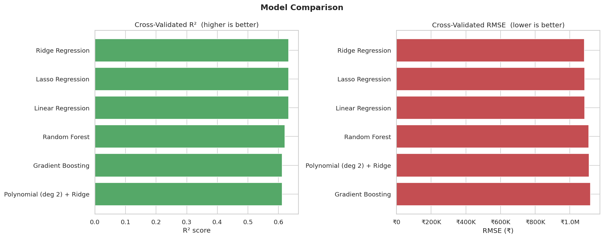
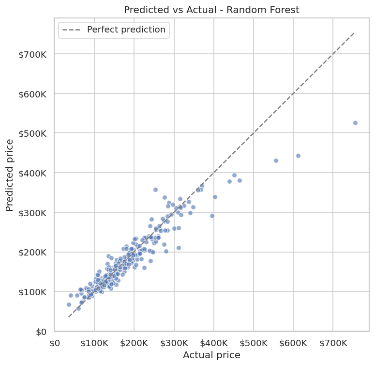

# 🏠 Housing Price Prediction

Predicting house prices from their physical attributes and amenities, using a
clean, reproducible, **leak-free** machine-learning pipeline.

<p>
  
  
  
</p>

---

## Overview

Given 545 houses described by 12 features (area, bedrooms, bathrooms, stories,
parking, and amenities such as air-conditioning, a basement, or a preferred
location), the goal is to predict the sale **price**.

The project compares six regression models under identical, honest conditions
and reports every error metric **in real rupees** so the results are actually
interpretable.

> **Dataset:** [Kaggle Housing dataset](https://www.kaggle.com/datasets/ashydv/housing-dataset)

## Results

Five-fold cross-validation across all candidate models:

| Model | R² | RMSE (₹) | MAE (₹) |
|-------|-----|----------|---------|
| **Ridge Regression** ⭐ | **0.633** | 1,083,790 | 805,794 |
| Lasso Regression | 0.633 | 1,084,287 | 806,463 |
| Linear Regression | 0.632 | 1,084,538 | 807,180 |
| Random Forest | 0.621 | 1,108,356 | 804,469 |
| Gradient Boosting | 0.612 | 1,117,763 | 804,724 |
| Polynomial (deg 2) + Ridge | 0.612 | 1,109,692 | 814,444 |

On the held-out 20% test set, the best model (**Ridge**) scores **R² = 0.65**,
**RMSE ≈ ₹1.33M**, **MAE ≈ ₹0.97M**.

**Key finding:** the price relationship on this dataset is largely *linear* —
regularised linear models match or slightly beat the tree ensembles, and
`area`, `bathrooms`, and `airconditioning` are the most influential features.

<p>
  
  
</p>

See [`reports/results.md`](reports/results.md) for the full write-up and every
figure.

## Design decisions

A few choices that keep the results trustworthy:

- **No data leakage.** All preprocessing lives inside a scikit-learn `Pipeline`,
  so scaling and encoding are refitted **within each cross-validation fold** —
  the model never sees the validation rows during fitting.
- **Interpretable metrics.** The target `price` is kept in rupees rather than
  scaled, so RMSE and MAE are directly meaningful amounts.
- **Stable regularisation.** Polynomial features are paired with L2
  regularisation (Ridge); unregularised high-degree polynomials on binary dummy
  features are numerically unstable.
- **Reproducible.** A fixed random seed and a single `python main.py` entry
  point regenerate every result, figure, and report.

## Project structure

```
housing_price_prediction_project/
├── housing_price/            # the package
│   ├── config.py             # paths, column groups, constants
│   ├── data.py               # loading & train/test splitting
│   ├── features.py           # leak-free ColumnTransformer (scale + one-hot)
│   ├── models.py             # six model pipelines
│   ├── evaluate.py           # cross-validation & hold-out metrics
│   ├── plots.py              # all visualisations
│   └── pipeline.py           # end-to-end orchestration
├── data/
│   ├── Housing.csv           # raw dataset
│   └── Model_Evaluation_Results.csv   # generated
├── reports/
│   ├── figures/              # generated plots
│   └── results.md            # generated report
├── tests/                    # pytest suite
├── main.py                   # run everything
└── requirements.txt
```

## Quick start

```bash
# 1. Install dependencies (a virtual environment is recommended)
pip install -r requirements.txt

# 2. Run the full pipeline: load → explore → cross-validate → evaluate → report
python main.py

# 3. (optional) run the tests
pytest
```

Running `main.py` prints the model comparison to the console and regenerates
everything under `data/` and `reports/`.

## How it works

1. **Load** the raw CSV (`data.py`).
2. **Explore** — price distribution and a correlation heatmap (`plots.py`).
3. **Preprocess** inside each fold — standard-scale numeric features, one-hot
   encode categoricals (`features.py`).
4. **Cross-validate** six models with 5-fold CV, scoring R², RMSE and MAE
   (`evaluate.py`).
5. **Evaluate** the winner on a held-out 20% test set.
6. **Report** — save figures, a results CSV, and a markdown summary
   (`pipeline.py`).

## License

Released under the [MIT License](LICENSE).
