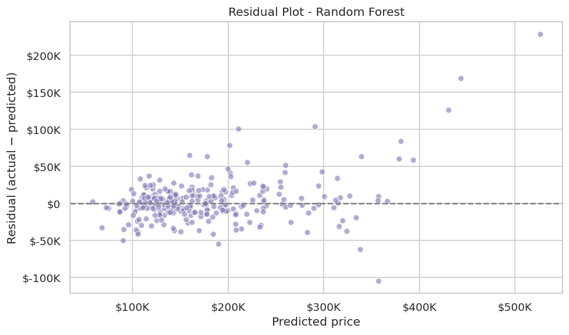
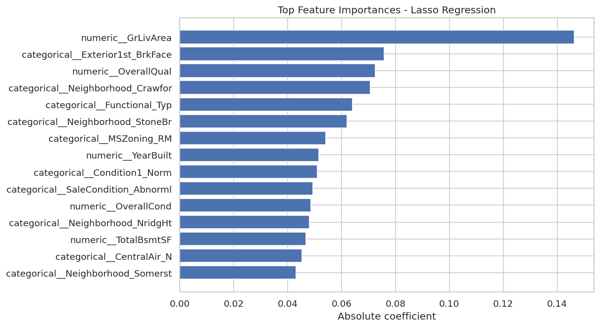
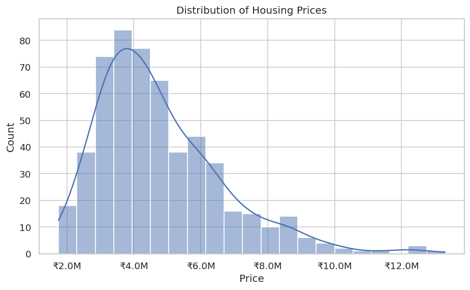
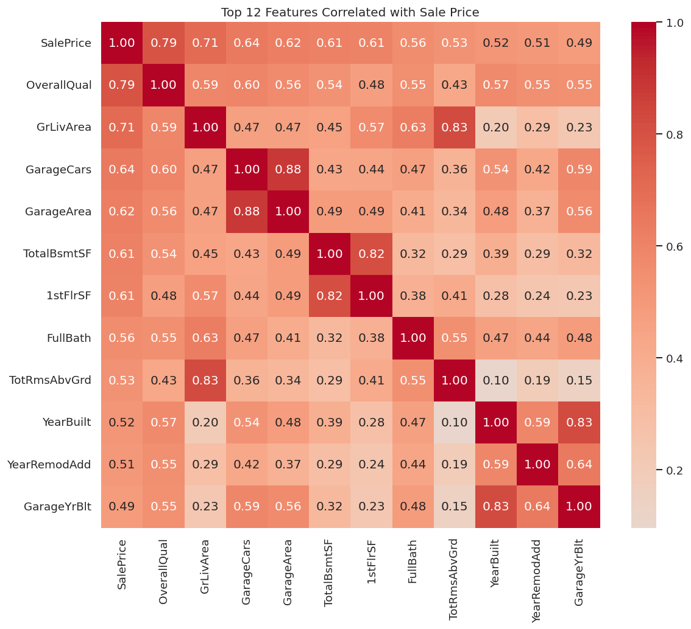

# Housing Price Prediction — Results

All models share a leak-free scikit-learn pipeline: preprocessing (scaling + one-hot encoding) is fitted inside each cross-validation fold, and the target `price` is kept in rupees so every error metric is interpretable.

- **Dataset:** Housing.csv (545 homes, 12 features)
- **Validation:** 5-fold cross-validation + a 20% held-out test set

## Cross-Validated Model Comparison

| Model | R² | RMSE (₹) | MAE (₹) |
|-------|----|----------|---------|
| Ridge Regression | 0.633 ± 0.072 | 1,083,790 | 805,794 |
| Lasso Regression | 0.633 ± 0.073 | 1,084,287 | 806,463 |
| Linear Regression | 0.632 ± 0.074 | 1,084,538 | 807,180 |
| Random Forest | 0.621 ± 0.064 | 1,108,356 | 804,469 |
| Gradient Boosting | 0.612 ± 0.070 | 1,117,763 | 804,724 |
| Polynomial (deg 2) + Ridge | 0.612 ± 0.101 | 1,109,692 | 814,444 |

**Best model:** Ridge Regression

## Held-Out Test Performance

Evaluated on the unseen 20% test split:

- **R²:** 0.652
- **RMSE:** ₹1,326,231
- **MAE:** ₹971,714

## Figures

## Takeaways

- Keeping the target in rupees and fitting preprocessing inside each fold gives honest, directly readable error metrics.
- Unregularised polynomial regression is numerically unstable on binary dummy features; pairing it with L2 regularisation (Ridge) makes it well-behaved.
- On this dataset the relationship is largely linear: regularised linear models (Ridge/Lasso) match or slightly beat the tree ensembles, and `area`, `bathrooms` and `airconditioning` are among the most influential features.
